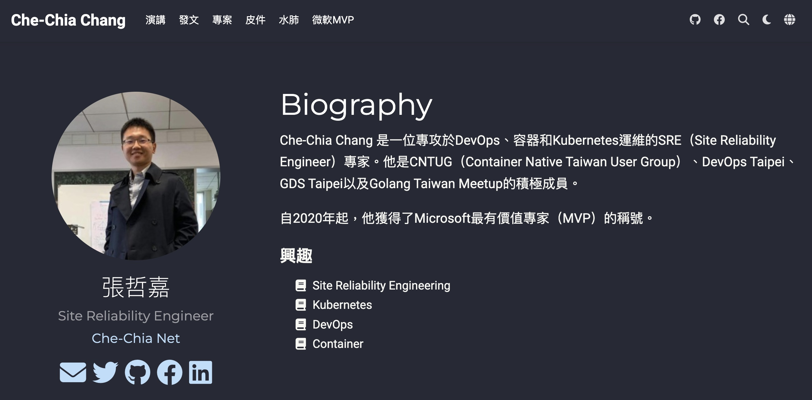
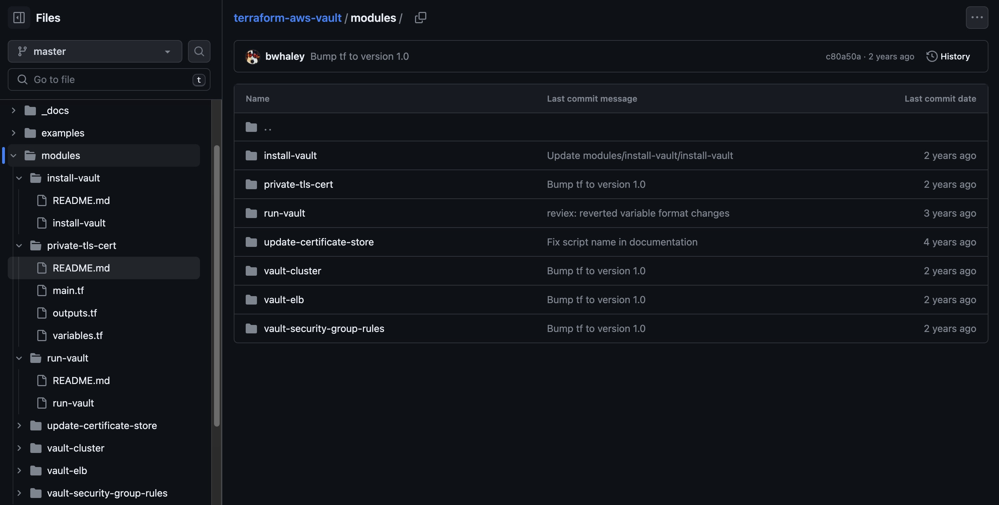
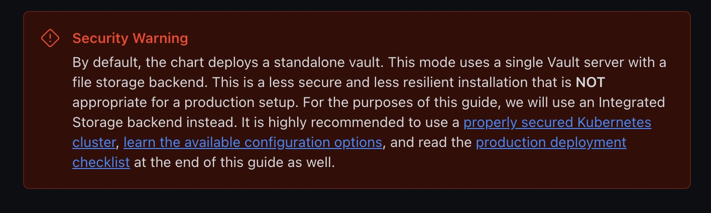



{}
Q1: 有過使用 hashicorp vault 的人請舉手

沒使用過的人不是這個 session 的目標聽眾，可以 QR code 拍下來去聽別場。例如對面同題材的session
QR code 有投影片，範例 github repo，投影片裡還有講稿，所以我今天在這裡的用處就是念稿，真的可以 qrcode 拍了回家看

Q2: 有使用過 infrastructure as code / terraform 的人請舉手

有使用 vault 但是沒有使用 IaC 的朋友，才是這場 session 的主要受眾

Q3: 有使用 iac deploy vault stack，或是有使用 iac / vcs 管理 vault 內的 policy 的人請舉手

這些人可以出去吃零食，今天講的內容你們都會了，我沒什麼東西可以跟你們分享

{}

---


## HashiCorp Vault
## 自建金鑰管理最佳實踐

[Che Chia Chang](https://chechia.net/) | [Vault 鐵人賽 workshop](https://chechia.net/zh-hant/tag/%E9%90%B5%E4%BA%BA%E8%B3%BD2023/)

{}
s
標題有稍微修改
{}

---



[About Me](https://chechia.net/zh-hant/)

---


### Outline
### from dev to prod-ready

- terraform deployment IaC
  - on aws / azure / gcp / k8s
  - 如何開始
- terraform configuration IaC
  - IaC everything
    - secret backends / auth method / role / policy / audit ... 
  - 工作流程自動化 gitflow / tested / automation

{}
manage vault infra & vault configuration from a aspect of devops
{}

---

## Vault 基礎的學習資源

- [2023-05-10 雲端地端通吃的私鑰管理平台](https://docs.google.com/presentation/d/1iex9lm89OCIR8IAoD1RPe4vcW--bcKBmMHoixDybqP8/edit?usp=sharing)
- [2023 鐵人賽: vault 10- day workshop](https://chechia.net/zh-hant/tag/%E9%90%B5%E4%BA%BA%E8%B3%BD2023/)
- [2021 鐵人賽: terraform 30 day workshop](https://ithelp.ithome.com.tw/users/20120327/ironman/4057)
- [範例 Github](https://github.com/chechiachang/vault-playground)
- 同一時間，Vault + Kubernetes 請出門對面DE會議室

{}
不會講 vault 的基礎操作，但如果你需要學習資源，你可以來這邊找
第一個 google slides 是我在其他場合的演講，適合第一次接觸 vault，或是正在評估是否要導入 vault 的團隊

第二個今年的 ithome 2023鐵人賽，我寫的內容就是 vault workshop，雖然寫到第十篇就因故停更，但前面 1-8 篇剛好是 vault 操作基礎，使用 chatgpt 翻譯 vault official tutorial，也是適合第一次使用 vault 的人

第三個是如果沒接觸過 infrastructure as code IaC，這個也是鐵人賽的 30 day workshop，這個有完賽佳作
{}

---

## [production deploy checklist](https://developer.hashicorp.com/vault/tutorials/kubernetes/kubernetes-raft-deployment-guide#production-deployment-checklist)

- End-to-End TLS
- Single Tenancy
- Enable Auditing
- Immutable Upgrades
- Upgrade Frequently
- Restrict Storage Access

{}

進入 production 前的維運問題

vault 官方建議的 prod checklist
大多需要定期更新，維護，而非一勞永逸一次性作業

例如 end-to-end TLS certificate 需要管理與更新

auditing 對 vault 的存取紀錄需要安全的輸出，並且能夠檢核。設定做一次就可以生效。但是實務上未來會需要不斷的根據外部稽核需求調整

immutable upgrades 指的是當你使用 vault server 與 storage backend，vault server 本身是 immutable 的，你可以自己使用 official binary build VM Image (ex. aws ami)，或是透過 container image release 來更新

upgrade frequently，但要做的安全，而且有效率，最好是做到半自動化或是全自動化，如果沒有 IaC 會比較耗工

{}

---

## Infrastructure as Code

導入 IaC ，做到頻繁且安全的 vault 更新，但同時又要有效率甚至全自動化

- multiple env: dev, stag, prod
- programable / reusable: 標準化，可重複使用的 code
- tested infrastructure

{}
以 vault 為目標
維運 vault 的第一目標：安全第一，不求高效能，但是追求安全
是我們要將 deploy / release / upgrade vault 中的風險降到最低

infra: 升級 vault 版本，調整 VM / container，調整 load balancer，除錯
config: 更改 auth-method / policy
- policy 容易改壞但無法及時發現，要用時才發現權限壞了
{}

---

## 如何開始 IaC for Vault

  - immutable Vault server
  - storage backend
  - load balancer
  - security group / firewall rule

{}
IaC 好棒，那有沒有什麼資源可以幫助我們開始 deploy IaC Vault
答案是有的
{}

---


[https://www.terraform.io/](https://www.terraform.io/)

{}
{}

---

## Deploy on public cloud

- https://github.com/hashicorp/terraform-aws-vault
  - https://github.com/hashicorp/terraform-aws-vault-starter
- https://github.com/hashicorp/terraform-azurerm-vault
- https://github.com/terraform-google-modules/terraform-google-vault

{}
在公有雲 deploy Vault，雲服務商有提供既有的terraform module
不一定要照單全收，可以試著架起測試環境，然後調整terraform module，成為適合自己產品的架構
調整架構需要考量的點，底下分析
{}

---

## Deploy [terraform-aws-vault](https://github.com/hashicorp/terraform-aws-vault)


{}
hashicorp 官方提供的 terraform-aws-vault 是一個不錯的開始
{}

---

## [terraform-aws-vault](https://github.com/hashicorp/terraform-aws-vault)

- ELB -> AWS Autoscaling Group -> EC2
- Backend: consul cluster
- Vault AMI
- security group 
- [tested](https://github.com/hashicorp/terraform-aws-vault/blob/master/test/README.md) by hashicorp with [terratest](https://github.com/gruntwork-io/terratest)

{}
goto https://github.com/hashicorp/terraform-aws-vault
{}

---

## [terraform-aws-vault](https://github.com/hashicorp/terraform-aws-vault)



{}
如何使用
- 可以參考 main.tf 範例
- 可以檢視 ./modules 內說明逐步操作
{}

---

## [terraform-aws-vault-starter](https://github.com/hashicorp/terraform-aws-vault-starter)

- ELB -> AWS Autoscaling Group -> EC2
- security group 
- [Integrated storage (raft)](https://developer.hashicorp.com/vault/docs/concepts/integrated-storage)

{}
goto https://github.com/hashicorp/terraform-aws-vault-starter
{}

---

## Integrated storage

- [integrated-storage](https://developer.hashicorp.com/vault/docs/internals/integrated-storage)
- Raft Consensus protocol
  - 出incident要有辦法解
  - stateful server
  - 備份，管理(資料遷移) util 工具未必夠成熟
- 選一個會維護的[storage](https://developer.hashicorp.com/vault/docs/configuration/storage)
  - [DynamoDB](https://developer.hashicorp.com/vault/docs/configuration/storage/dynamodb)
  - [MySQL](https://developer.hashicorp.com/vault/docs/configuration/storage/mysql) / [PostgreSQL](https://developer.hashicorp.com/vault/docs/configuration/storage/postgresql)

{}
注意storage是否能夠為維護，重啟，備份
{}

---

## On Kubernetes

argocd + vault helm chart

server 與 injector 建議分開兩個 argocd applicatoin / helm release獨立deploy
- [server](https://github.com/hashicorp/vault-helm/blob/main/values.yaml#L357)
  - 選一個會維護的[storage backend](https://developer.hashicorp.com/vault/docs/configuration/storage)
- [injector](https://github.com/hashicorp/vault-helm/blob/main/values.yaml#L46)

{}
goto https://github.com/hashicorp/vault-helm/blob/main/values.yaml#L357

注意server 是否 ha
{}

---

## [Deploy On Kubernetes](https://developer.hashicorp.com/vault/tutorials/kubernetes/kubernetes-raft-deployment-guide)



- [secure your k8s](https://kubernetes.io/docs/tasks/administer-cluster/securing-a-cluster/)

{}
goto https://kubernetes.io/docs/tasks/administer-cluster/securing-a-cluster/

FAQ: on VM or on K8s?
問題不是 vault 在 VM 上安全，還是在 k8s 上安全
而是團隊能不能 secure 底下的 infra，如果熟 VM 就會覺得 VM 好做
secure k8s 是 VM + k8s 都要
{}

---

## 回到 Outline: prod-ready

- terraform configuration IaC
  - auth method / config / role
  - secret mounts
  - policy
    - team / people
    - application / service account
  - audit log

---

## Vault Configuration IaC 

- VCS / PR reviewed
- well-formed / linted / no-typo
- multiple env: dev, stag, prod
- programable / reusable: 標準化，可重複使用的 code
- tested
  - 可以為 terraform code 寫測試
  - 可以寫整合測試腳本測試 vault dev server
- automation
- auditable

{}
version control 有多重要？
- 有 / 沒有 review 的 code 品質，天差地遠
- 分享團隊知識，分享變更資訊
- 避免最雷的同事出包，全 team 的效能瓶頸
- change management 對於 vault 內的的更改要最嚴格控制
  - 沒有『誒是誰改了這個我怎麼不知道』這回事

Linter / formated 是工作效率的根本

多環境測試
- 有安全的測試環境，才能促進團隊創新
- 有 / 沒有 經過完整環境測試的 release 品質，天差地遠

Programable / Reusable
- variable / for loop
- reusable module / don't repeat your self

tested policy code
- policy as code
- terratest

automation
- gitflow
- secured admin access only to workflow. developer don't have admin access.

auditable
- audit in code / review
- live server generate audit log
- 外部稽核
{}

---

## [hashicorp official tutorial](https://developer.hashicorp.com/vault/tutorials/policies/policies#write-a-policy)

```
tee admin-policy.hcl <<EOF
# Read system health check
path "sys/health"
{
  capabilities = ["read", "sudo"]
}

# List existing policies
path "sys/policies/acl"
{
  capabilities = ["list"]
}
EOF
```

{}
configure vault policy with CLI
{}

---

## [hashicorp official tutorial](https://developer.hashicorp.com/vault/tutorials/policies/policies#write-a-policy)

```
vault policy write admin admin-policy.hcl

vault policy list

vault policy read admin
```

{}
CLI 管理很不方便
沒有 aggregated list view
查錯時需要耗費大量 api call 列出 policy 查表
透過 IaC sync policy code to server
{}

---

## How to use

prerequisites: vault, terraform, terragrunt

```
git clone git@github.com:chechiachang/vault-playground.git

cd vault-playground/usage/03-terraform-lives/

terragrunt init
terragrunt plan
```

{}
terraform 與 terragrunt 我的部落格上都有許多介紹文章，ithome 鐵人賽也有 30day workshop
{}

---

## VCS & PR review

- local lint with [git pre-commit hook](https://github.com/antonbabenko/pre-commit-terraform#terraform_fmt)
- PR
  - lint check
  - pipeline module test `terraform test` on github action
  - integration test against vault dev server
  - review
- merge / automation
  - apply to dev environment automatically
  - release candidate tag will apply to stag automatically
  - release tag will push to pre-production and production

---

## Multiple environment

- dev -> stag -> prod 環境很接近
  - IaC + config as code
- 搭設新環境只需1分鐘(VM)，甚至數秒(container)，可以進行大量的測試

---

## Test

- IaC code 可以使用 `terraform test`
- config as code 可以使用 `terraform test`
- live infrastructure 可以使用 terratest

---

## Test [Example](https://github.com/chechiachang/vault-playground/tree/master/usage/03-terraform-modules/secret_backend/kv_v2)

```
resource "test_assertions" "main" {
  component = "main"
  equal "mount_path" {
    description = "default mount_path is ${local.mount_path}"
    got         = local.mount_path
    want        = local.mount_path
  }

  equal "max_versions" {
    description = "default max_versions is 10"
    got         = local.max_versions
    want        = 10
  }

  equal "delete_version_after" {
    description = "default delete_version_after is 10"
    got         = local.delete_version_after
    want        = 12600
  }
```

{}
這個 module 只是一個 kv engine，所以隨手寫了一個簡單的 test
Demo 我在本地隨手跑一下測試
當你使用 terraform 時間夠久，使用規模越大時，會有復雜的 module，這時有寫測試的 module 就是天差地遠
{}

---

## Policy as code for vault

- vault ACL 是基於 path 設定權限
- 當policy有成千上萬條，彼此可能會 conflict
- policy 的 policy
  - 高高層次的(公司的資安政策)透過 policy as code 定義
  - 寫到 vault policy
- [Open Policy Agent (OPA)](https://www.openpolicyagent.org/docs/latest/#1-download-opa)
- [Sentinel(Vault Enterprise): EGP](https://developer.hashicorp.com/vault/tutorials/policies/sentinel#endpoint-governing-policies-egps)

---

## Gitflow & automation

- PR
  - [atlantis](https://www.runatlantis.io/) run terraform plan
- PR merged
- PR apply
  - apply to dev environment automatically with gitflow
  - release candidate tag will apply to stag automatically
  - release tag will push to pre-production and production

{}
goto https://www.runatlantis.io/
PR comment 下會有針對 dev environemtn plan 的結果
使用 github webhook，可以直接在 PR approved 後，命令 atlantis 直接 apply 到 dev server
避免使用工程師 local machine 存取遠端環境，避免工程師取得管理員權限，避免人為操作失誤造成的 incident
{}

---

## Summary

- 使用 IaC deploy vault，並依照團隊需求逐步調整 infra
- 使用 IaC 管理 vault 內部一切 config

---

# Questions?
