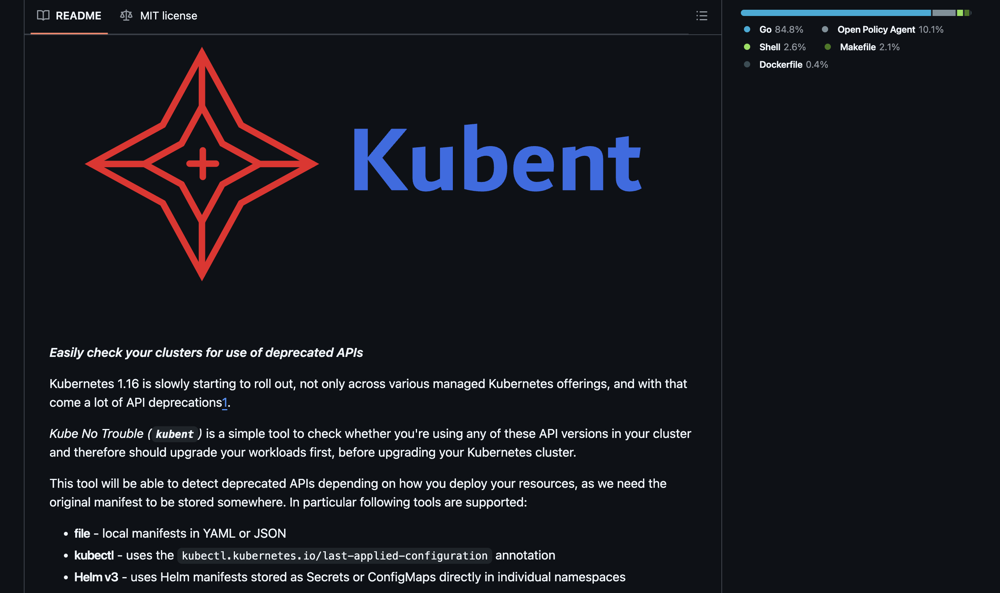
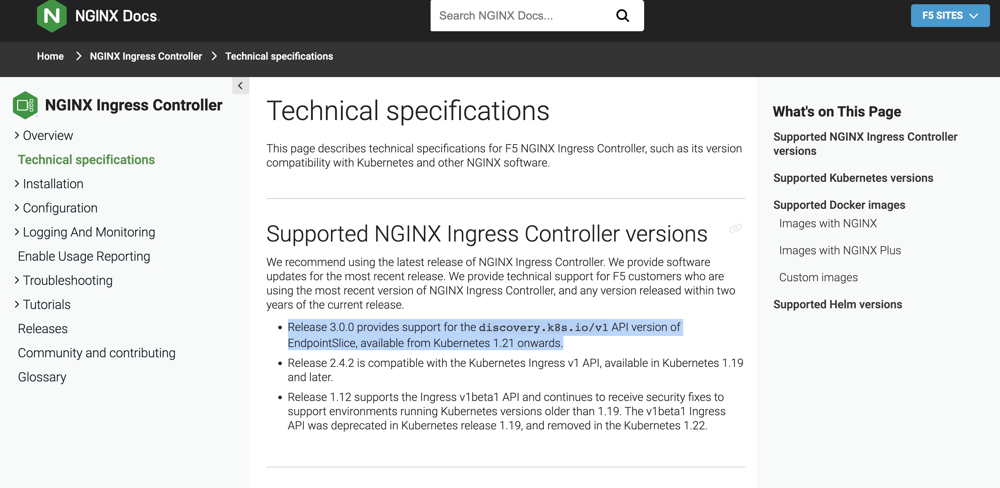
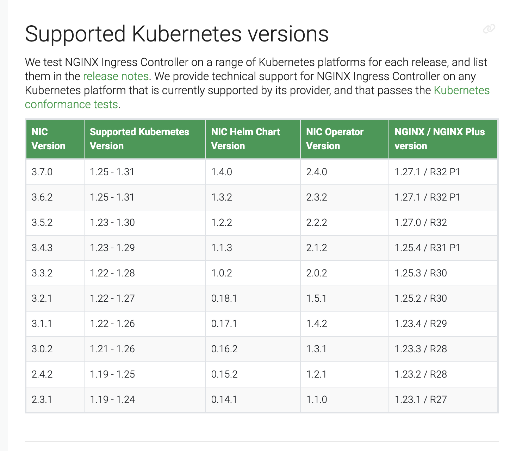

### Upgrade A VM Based Cluster

[Che Chia Chang](https://chechia.net/)

{}
{}

---



---

### 今天的主題

- 為何要 AWS 自架 K8s
- 升級事前閱讀文件與規劃
- 需要升級的元件
- 實際升級的步驟
- 自動化 k8s 升級

---

### 今天的目的

- 統整散落的資訊
- 升級需要考慮的事情
- 可能哪些地方有雷，導致升級出錯
- 產生自己團隊的升級 SOP

---

### 背景：什麼是 VM-based Cluster

- Managed Kubernetes Service (GKE, EKS, AKS)
  - 公有雲託管 control plane，透過雲提供的介面控制
- self-hosted Kubernetes
  - cloud formation template ec2 node

---


---

### 什麼是 VM-based Cluster

公有雲只提供 VM，自己用其它工具搭 K8s Components
- kubeadm, kops, kubespray / docker, containerd, cri-o / container or systemd / ...
- 自己管理 control plane，包含 etcd, apiserver, controller-manager, scheduler
- 依需求選用公有雲提供的架構，ex VPC, ELB, EBS, S3, RDS, IAM, Route53, CloudWatch, CloudTrail...

---

Self-hosted control plane


---

### 所以為何要在AWS上自架 K8s？

---

### 因為 2016 年的時候沒有 eks

---

###  2015- 年有很多 self-hosted k8s 解決方案

- 2014/10/15 kubernetes v0.4 [github](https://github.com/kubernetes/kubernetes/releases/tag/v0.4)
- 2014/11/04 [GKE release for 0.4.2](https://cloud.google.com/kubernetes-engine/docs/release-notes-archive#november_4_2014)
- 當時有很多解決方案再提供 self-hosted k8s，基於這些方案，產生 VM-based k8s
  - [github.com/getamis/vishwakarma](https://github.com/getamis/vishwakarma)
- 2017/10/24 [AKS generally available](https://azure.microsoft.com/en-us/blog/introducing-azure-container-service-aks-managed-kubernetes-and-azure-container-registry-geo-replication/)
- 2018/06/05 [EKS generally available](https://aws.amazon.com/blogs/aws/amazon-eks-now-generally-available/)

{}
{}

---

### Self-hosted control plane

self-hosted control plane 其實不難，那時有很多成熟的解決方案
- [k8s summit Etcd Workshop](https://chechia.net/zh-hant/talk/kubernetes-summit-get-started-with-etcd-kubernetes/)
- 降低服務商依賴
- 可以跨雲，跨地端，混合雲
- 自訂化，換 VM disk image，CNI，CSI，Ingress Controller
- 成本控制

---

### Self-hosted control plane: 壞處

- 團隊多做一些事情
- 工程師個人可以(必須)學到很多東西
- cloud managed k8s 越做越好，自己架的理由越來越少

---

### Self-hosted 多了要升級的東西

- VM: based image / package / CVEs (不在今天的範圍)
- [k8s doc 建議的升級順序](https://kubernetes.io/docs/tasks/administer-cluster/cluster-upgrade/#manual-deployments)
- Etcd Cluster
- Control Plane
  - apiserver
  - controller manager
  - scheduler
  - cloud controller manager

---


---

### 實際來看升級的步驟

---

### 實際升級的順序

- 研究決定升版目標
  - 必讀 K8s CHANGELOG / Urgent Upgrade Notes
- 檢查 app 的版本依賴 (i.e 升 k8s 會壞的 app)
  - K8s resource API Deprecated
  - App Controllers
- Etcd Cluster
- Apiserver
  - Controller Manager
  - Scheduler
- Node (kubelet, kube-proxy, CNI agent)

---

### 事前研究跟規劃

- 確認目前版本
- 目標版本
  - 升版的目的：(feature, EOL, ...)
  - 元件彼此相容的版本
  - 每個小版號 Release Cycle ~ 4 months
  - 有重疊時間，所以大概是 3 個月出一版新的
  - path release ~ 8 months

---

### K8s Release Cycle ~ 4 months


---

加上 ~ 8 months patch release


---

### 多久升級一次 k8s

- 每季更新一次
  - 跟 feature，每次升 N+1 版
  - 跟 EOL，每次升 N+1 版
- 每年更，維持在 EOL 前，每次升 N+3 版

---

### 升級變成 routine

更新 k8s 也不是短短幾天的工作，要有時間規劃，測試，檢查
- 除了版本不同，每次要做的流程類似
- 與其是一個 task 更像是一個 routine 的工作
- 重點變成不是多久更新一次
- 而是幾然需要常做，該如何**有效率(自動化)的完成升級**

---

### 必讀文件 K8s CHANGELOG

Urgent Upgrade Notes (No, really, you MUST read this before you upgrade)
- [CHANGELOG-1.31.md](https://github.com/kubernetes/kubernetes/blob/master/CHANGELOG/CHANGELOG-1.31.md#urgent-upgrade-notes)
- 最少要看 Urgent Upgrade Notes 跟 action required

---

### 不看 CHANGELOG 真的不行嗎？

可以，流程會變成
- k8s 升級上去
- 發現有東西壞掉，開始 debug
- 一路從 app, infra, k8s resource, 查到 k8s 上的問題
- 最後還是看了 CHANGELOG
- 你以後就會乖乖的把 CHANGELOG 看完

---

### 升級事前研究跟規劃

- 了解 k8s release lifecycle
- 依據團隊政策，設定更新週期
- 了解目前版本與目標版本的差異
- 上述工作轉為週期性的常態工作
- 加速升級的速度

---

### 需要升級的 K8s Components


---

### Etcd Upgrade 官方文件

- https://etcd.io/
- 分散式 key-value store
  - 可以 zero downtime rolling upgrade
  - 可以 zero downtime rolling downgrade

---

### Etcd Upgrade 步驟

[https://etcd.io/docs/v3.5/upgrades/upgrade_3_5/](https://etcd.io/docs/v3.5/upgrades/upgrade_3_5/)
- etcd 在 minor version 升級時，可以 zero downtime rolling upgrade
- 維持 etcd cluster quorum
- delete then add member (維持 quorum 先減後增）
- 保留 etcd data 與 endpoint ip，開回後直接上線
- 只需 sync delete -> add 中間的資料差

---

### terraform for IaC

要換的 etcd VM 可以拆解成 terraform module
- VM -> EC2
- base os -> AMI
- data disk (etcd data) -> EBS
- ip (etcd endpoint) -> ENI
- **etcd binary -> S3**
- etcd config / flags -> launch template / cloud init

---

### terraform gitflow

- PR 改 binary etcd:v3.4.34 -> etcd:v3.5.4
- PR review -> 自動 trigger terraform plan
- **PR merge** -> 自動 apply dev / stag
- 自動化執行測試
- Monitoring 監測一直都在
- 有問題: revert PR 自動 rollback
- 沒問題: **人工確認上述步驟，開出 prod PR** -> 自動 apply prod
- 有問題: revert PR 自動 rollback

---

##### 從專注完成升級，變成專注在自動化流程

其他 k8s 元件的管理也是同樣方式，將人工降到最低

---

### Etcd Upgrade 該注意

https://etcd.io/docs/v3.5/op-guide/failures/
- Majority of members are unreachable
- Network partition
- 遵守 SOP 先減後增

---

### kube-apiserver


---

### apiserver doc

https://kubernetes.io/docs/tasks/administer-cluster/cluster-upgrade/#manual-deployments
- 先升級 kubectl
- apiserver 小版號 rolling upgrade zero downtime
- 如果建立 k8s 時有用工具/平台，ex kubeadm, kops, kubespray，會有對應的升級指令
- terraform 直接更換 apiserver 節點

---

### Supported Version Skew

https://kubernetes.io/releases/version-skew-policy/
- kube-apiserver 彼此最多差 1 個小版號
  - 1.30 升 1.31 過程可以無痛
- controller manager, scheduler, cloud controller manager
  - (vs apiserver) 最多差 1 個小版號
  - 升級 apiserver 後，跟著升級同板
- kubelet, kube-proxy
  - (vs apiserver) 最多差 3 個小版號
  - apiserver 1.30 升 1.31 時，node 1.28, 1.29, 1.30 可以無痛

---

### api deprecated

- [Deprecated API Migration Guide](https://kubernetes.io/docs/reference/using-api/deprecation-guide/)
- [Deprecation policy](https://kubernetes.io/docs/reference/using-api/deprecation-policy/)

---

### 使用工具掃描 k8s resource

- 如何確認 app 的 k8s resource 有沒有使用到 deprecated API
- [https://github.com/doitintl/kube-no-trouble](https://github.com/doitintl/kube-no-trouble)
- 加入到升級流程，自動化
  - （沒升級的時候）週期性的掃描
  - app 開發的 CI 應該導入 `lint --kube-version`
  - 如果有 app 使用到 deprecated API，通知 app owner 提早更新
  - 升級前再掃描一次

---

### kube-no-trouble



---

### 產生新版 apiserver VM

要換的 apiserver VM
- VM -> EC2
- base os -> AMI
- Auto Scaling Group + Load balancer
- **更新apiserver binary** -> S3 launch template / cloud formation
- apiserver config / flags -> launch template / cloud init

---

### 移除舊版 apiserver graceful shutdown

load balancer -> auto scaling group -> EC2 instance

- 透過 load balancer 的設定，確保 apiserver 有足夠的時間離線
  - request 都已處理完
  - load balancer 關閉連入
  - 等待 graceful period，確認沒有 request
  - 關閉服務，關閉 EC2 instance
- 監測 apiserver 的 metrics，錯誤率提高自動告警

---

### scheduler and controller manager

- 如果是 master VM (api-server, scheduler, controller manager, cloud controller manager)
  - 一起升級
  - 一起建立新版 VM
  - 一起移除舊版 VM
- 如果是其他方式 apply，依照對應的升級指令

---

### 依賴 k8s api 的 app

- https://kubernetes.io/docs/concepts/architecture/controller/
- 許多 controller 會需要依賴特定的 k8s api
  - 進而依賴特定版本的 k8s
- 會打 k8s api 的 app
  - 自家寫的 app 有用 k8s [client-go](https://github.com/kubernetes/client-go)

---

### app 升級檢查

- 掃描 k8s resource 使用的 api version 大部分掃得出來
- 各 controller 的文件才會描述為何有版本依賴
  - 以及如何升級 app controller 到新版的 k8s api
- 團隊應維護**依賴 k8s api 的服務列表**
  - 或是使用工具 or script 快速列出 cluster 內部的服務

---

https://docs.nginx.com/nginx-ingress-controller/technical-specifications/



---

https://docs.nginx.com/nginx-ingress-controller/technical-specifications/



---

### 小結：k8s control plane 升級

- etcd
- changelog
- apiserver
  - api deprecation
- scheduler, controller manager

---

### Node 升級

- kubelet, kube-proxy 升級本身不是問題
- 需要搬移 worklaod
- 有沒有 worklaod 依賴 k8s api (ex. [client-go](https://github.com/kubernetes/client-go)
  - 有的話應該收錄上升級的服務列表，每次升級都需要檢查
  - 有直接與 k8s api 互動的 app，強烈建議要寫 unit test

---

### Node 升級簡單來說是建新拆舊


---

### Node 升級需要搬移 worklaod

開新的 node，舊的 node 上的 workload 需要轉移

- 準備空 node
- 舊 node 打上 node taint，避免 worklaod 跑上去
- **依序**重啟 workload
  - app 彼此可能會有依賴關係，i.e. 重啟 a 時 b 會噴錯
  - ex. backend + in-k8s redis
- 或是依照 node drain node

---

### Workload retry

app 要實作 auto retry，來處理暫時斷線與達到 auto recovery
- 重啟 workload 可能造成大量的重啟
- 同時大量 connect + retry 有可能會打壞被依賴的服務
  - ex. backend + in-k8s redis，大量的 backend pod 同時重啟，會打壞 redis
- 所以還要實作 retry delay, timeout backoff

---

### 如何重啟有依賴的 Workload

依據團隊的目標而定
- ex 目標是最少整體重啟次數
- 先重啟被依賴的服務 ex. redis
- 在重啟依賴的服務 ex. backend
- 考驗服務的 replication 數量是否足夠，能否支撐大量重啟

##### 依序重啟 workload，應該變成自動化的腳本

---

### 驗證

Workload 轉移到新版本，測試 worklaod 是否正常運作
- 針對 worklaod 有設定 monitoring 與 metrics
- ex. cpu, memory 升級後增加太多，或是用的太少
- ex. api 在重啟過程中噴 5xx，5xx 的次數異常增加，自動 alert
- ex. api, websocket 錯誤比例增加
- ex. non 2xx 的 access log 量增加

##### 與其說是測試，更像是把持續監控做個更完整

---

### 升級後跨環境測試

在測試環境導入更多測試
- chaos engineering 在平時就持續注入 error，根據 scenario 設定 k8s 的反應
  - ex. chaos monkey, chaos mesh
- load testing 測試 app 在新版本 k8s 上的效能
  - ex. https://github.com/grafana/k6
- 過去的 incident 的測試 script

##### 不是為了升級導入這些測試，而是因為有了這些測試，讓升級更有信心

---

##### K8s 升級有問題，不是有問題
##### 太晚發現才是問題

---

### 好的監測是升級的保護傘

---

怎麼知道 k8s 升級有沒有壞？用 kubectl 打看看

```
while true; do
    kubectl get pods -n kube-system; 
    sleep 2;
done
```

---

### 監測

上面的各個步驟都仰賴監測自動告警
- 元件壞了，要有監測紀錄
- 重要元件壞了，要主動告警
- 沒壞但是有異常變動，要主動告警
- 出錯沒監測到，補上監測跟測試，再來一次，累積新版本的信心

---

### 監測參考工具

- [prometheus-operator](https://github.com/prometheus-operator/prometheus-operator)
- prometheus
- grafana
- [kubernetes-mixin](https://github.com/kubernetes-monitoring/kubernetes-mixin/tree/master/dashboards) alert, rule, dashboards
  - https://samber.github.io/awesome-prometheus-alerts/

---

### 願景：自動化 k8s 升級

今天討論的步驟，有哪些可以進一步再自動化的

- 看 CHANGELOG，選定目標版本
- 掃描服務 k8s api version
- 排程升級的時間
- 升級 etcd
- 升級 kube-apiserver, scheduler, controller manager
- 升級 node
- 遷移 workload

---

### We're hiring!

https://www.cake.me/companies/maicoin/jobs


---

### 參考資料

- https://kubernetes.io/docs/tasks/administer-cluster/cluster-upgrade/
- [Overview: Official doc](https://kubernetes.io/docs/tasks/administer-cluster/cluster-upgrade/)
