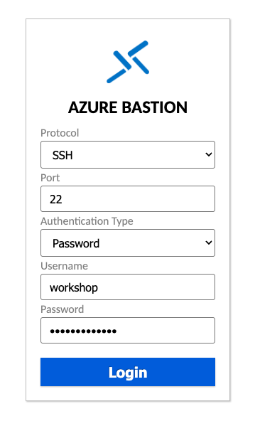

### Etcd workshop 行前準備

本次 workshop 以 hands-on 的方式進行，累積操作經驗為主，講解與說明為輔。觀念內容有準備教材，需要參與者自行閱讀。講師會免費提供 Azure VM 供同學遠端操作使用。

1. 有自己的電腦，可以上網，會使用 docker
    1. 選項1: 使用自己的電腦，在 docker 啟動開發環境
    1. 選項2: 使用自己的電腦，遠端連線講師提供的 VM，在VM 中啟動 docker 開發環境

---

#### Kubernetes Summit 2025
## Get started with Etcd & Kubernetes
##### 手把手入門 Etcd 與 Kubernetes
##### ~ Che Chia Chang @ [chechia.net](https://chechia.net) ~

---

{}


🔽

---

### We're hiring!

https://www.cake.me/companies/maicoin/jobs


{}

---

### 大綱

1. 確認大家都有操作環境
1. docker 啟動 etcd
1. etcdctl 存取 etcd
1. docker 啟動 etcd cluster
1. docker 啟動 k8s control plane
1. kubectl 存取 k8s control plane
1. 維運 k8s 所需的 etcd operation

---

### 如何進行 workshop

- 講師會在台上帶頭影片的內容
- 參與者在自己的機器上操作
- 參與者可以跟台上的進度，也可以超前進度向後操作
- 進度落後不太會影響後續操作，不必擔心
- 加分題是重要，但沒時間於今日完成的內容，請自行參考
- 有很多問題也很正常，產生疑問也是工作坊的目的

---

### 準備環境

- 選項1: 使用任何電腦，遠端連線講師提供的 VM，在VM 中啟動 docker 開發環境
- 選項2: 使用非 ubuntu (mac, windows) VM / 電腦，在本機 docker 啟動開發環境
- 選項3: 使用 ubuntu VM / 電腦，在本機 docker 啟動開發環境

---

### 選項1: 存取遠端VM

1. 至[workshop.chechia.net](https://workshop.chechia.net) 領取一台 VM 並簽名
1. googel sheet 左邊 url，開啟 bastion 連線
1. Protocol: SSH，port 22，authentication type: password
1. 帳號密碼在[workshop.chechia.net](https://workshop.chechia.net)

```
cd etcd-playground
ls
```

---

### 選項1: 存取遠端VM



---


### 選項2: 使用非 ubuntu 的電腦
##### mac, linux 或 windows 都可以(用 windows 可能會有指令格式相容性問題)

1. 自己電腦有裝 [docker](https://docs.docker.com/get-started/get-docker/), [etcdctl](https://github.com/etcd-io/etcd/releases/), [kubectl](https://kubernetes.io/docs/tasks/tools/#kubectl)
2. git clone repository
3. docker 啟動開發環境

```
git clone https://github.com/chechiachang/etcd-playground.git
cd etcd-playground
ls
```

---

### 選項3: 產生 ubuntu VM 的環境
### 回家想要自建 workshop 環境

workshop 提供的機器，是 ubuntu 24.04 + docker 環境。安裝這些東西，即可自行產生一台 workshop 環境

- [github.com/chechiachang/terraform-azure](https://github.com/chechiachang/terraform-azure/blob/main/templates/cloud_config/workshop.yaml)
- [docker](https://docs.docker.com/get-started/get-docker/), [etcdctl](https://github.com/etcd-io/etcd/releases/), [kubectl](https://kubernetes.io/docs/tasks/tools/#kubectl)

---

{}

### 確認大家都有操作環境
##### 等待的同時，說明何為 Etcd
🔽
- 使用自己的電腦
    - 裝 [docker](https://docs.docker.com/get-started/get-docker/), [etcdctl](https://github.com/etcd-io/etcd/releases/), [kubectl](https://kubernetes.io/docs/tasks/tools/#kubectl)
    - git clone repository + docker compose up -d
- 使用 VM
    - [workshop.chechia.net](https://workshop.chechia.net)

```
git clone https://github.com/chechiachang/etcd-playground.git
cd etcd-playground/00-prerequsites/
docker compose up -d
```

---

https://kubernetes.io/docs/concepts/overview/components/


---

https://kubernetes.io/docs/concepts/overview/components/

> Consistent and highly-available key value store used as Kubernetes' backing store for all cluster data.

- etcd 是一個分散式的 key-value 資料庫
- Kubernetes 的資料都存放在 etcd 中
- 使用公有雲服務時，etcd 通常是被管理起來的
    - 例如 AWS 的 EKS, Azure 的 AKS, GCP 的 GKE
- 使用自建的 Kubernetes 時，etcd 通常需要自行安裝與維運
    - 備份與還原，災難復原，擴充節點，安全性，效能...等等

{}

---

### etcd 基礎操作: 啟動一台 etcd

一行一行執行底下指令，來啟動一台 etcd

```
cd etcd-playground
ls

cd 00-prerequsites/
cat docker-compose.yaml 

docker compose up -d
docker ps
docker logs -f etcd-0
```

卡住時 ctrl + c to exit

指令打一半可以按 tab auto complete

---

##### etcd 基礎操作: 啟動一台 etcd


graph TD
    subgraph "Remot Host (Ubuntu VM)"
        A("etcd-0 (driver: bridge)")
        B["terminal (kubectl, etcdctl)"]
    end
    subgraph "Local(自己的電腦)"
        C["Web Browser"]
    end
    B -- 控制 --> A
    C -- Azure ssh bastion --> B

    subgraph "Local Host (自己的電腦)"
        A1("etcd-0 (driver: bridge)")
        B1["terminal (kubectl, etcdctl)"]
    end
    B1 -- 控制 --> A1


---

### etcd 基礎操作: etcdctl

https://etcd.io/docs/v3.5/tutorials/ 中的幾個範例
- Reading from etcd
- Writing to etcd

```
etcdctl get foo
etcdctl put foo "Hello World"
etcdctl get foo
```

---

### etcd 基礎操作: etcdctl

https://etcd.io/docs/v3.5/tutorials/ 中的幾個範例
- How to get keys by prefix

```
etcdctl get --prefix "" 
etcdctl get "" --prefix --keys-only

etcdctl put foo2 2
etcdctl put foo5 5
etcdctl put foo4 4
etcdctl put foo3 3

etcdctl get foo --prefix --keys-only
etcdctl get foo --prefix --keys-only --sort-by=KEY --limit=5
etcdctl get foo --prefix --keys-only --sort-by=MODIFY --limit=5
```

---

### etcd 基礎操作: etcdctl

請嘗試操作 https://etcd.io/docs/v3.5/tutorials/ 中的幾個範例
- How to delete keys
- How to watch keys
- How to check Cluster status

```
etcdctl del foo

etcdctl put k1 value1
etcdctl put k2 value2
etcdctl del --prefix k
```

---

### etcd 基礎操作: 重啟 etcd

透過以下 command 重啟 etcd
- `docker ps` 確認 etcd 是否還在運行

```
docker ps
docker compose down
docker ps
docker compose up -d
```

---

### etcd 基礎操作: Quiz

1. 重啟 etcd 後，是否還能讀取到 foo 的值？為什麼？
2. 請用50個字，描述你目前覺得 etcd 是什麼？
   - 把答案填到 [workshop.chechia.net](https://workshop.chechia.net)
   - 不是考試，隨意發揮，重點在促進大家思考

```
etcdctl put foo bar
docker compose down
docker compose up -d
etcdctl get foo
```

---

### etcd 基礎操作: Answer

1. 本 workshop 的 docker-compose.yml 中，etcd 的資料是存放在本地的 etcd0 資料夾中，因此重啟後，資料不會遺失。透過以下指令可以清除 etcd0 資料夾中的資料
2. https://etcd.io/docs/v3.5/learning/why/

```
cd 00-prerequsites/
sudo ls etcd0
sudo ls etcd0/member

docker compose down --volumes
sudo rm -rf etcd0/*

# 新的 etcd
docker compose up -d
ls etcd0
```

---

### 閱讀資料

- https://etcd.io/docs/v3.5/learning/why/
- https://github.com/chechiachang/etcd-playground/blob/main/00-prerequsites/README.md

---

### 加分題為自己加分：authentication
##### 啟用 etcd 的 authentication

- 使用 userA 登入 etcd
- 使用 userA 寫入資料
- 使用 userB 讀取資料
- 更改 docker-compose.yaml 啟用 authentication，關閉匿名存取
- https://etcd.io/docs/v3.5/op-guide/authentication/

---

### 加分題：如何使用 vim 編輯 docker-compose.yaml

```
# 00-prerequsites 目錄下
vim docker-compose.yaml
```
- 上下左右移動
- i 進入 insert 模式
- 可以打字插入，del 刪除
- esc 離開 insert 模式
- 輸入 冒號WQ (:wq) + enter 儲存並離開 vim
- 卡住可以嘗試連按 esc 鍵，然後輸入 :q! + enter 強制離開 vim

---

### 加分題卡住乃兵家常事，大俠請重新來過即可

```
# 00-prerequsites 目錄下
docker compose down --volumes
sudo rm -rf etcd0/*
```

---

### 加分題為自己加分：authentication

```
# 可能會用到的 cmd
etcdctl role add
etcdctl role grant-permission
etcdctl user add
etcdctl user list
etcdctl auth status
etcdctl auth enable
```

---

### etcd Clusters: 準備啟動多台 etcd
##### 首先先移除舊的 etcd

- 先關閉 00-prerequsites 的 etcd
- 透過 `--volumes` 刪除 docker volume
- 刪除 etcd local volume 資料夾

```
# 00-prerequsites 目錄下
docker compose down --volumes
sudo rm -rf etcd0/*
```

---

### etcd Clusters: 啟動多台 etcd

```
cd ../
cd 01-cluster/
cat docker-compose.yaml 

docker compose up -d
docker ps
```

---

### etcd Clusters: 檢視狀態

- 預設 etcdctl 會連線到 --endpoints=[127.0.0.1:2379]
- 使用 --endpoints 指定要連線到的 etcd
- 使用 export ETCDCTL_ENDPOINTS 指定要連線到的 etcd

```
etcdctl endpoint status

endpoint, ID, version, db size, is leader, is learner, raft term, raft index, raft applied index, errors
127.0.0.1:2379, b8c6addf901e4e46, 3.5.15, , 688 kB, 541 kB, 22%, 0 B, false, false, 5, 2104, 2104, , , false


etcdctl --endpoints "http://127.0.0.1:2379,http://127.0.0.1:2380" endpoint status
etcdctl --endpoints "http://127.0.0.1:2379,http://127.0.0.1:2380,http://127.0.0.1:2381" endpoint status

export ETCDCTL_ENDPOINTS="http://127.0.0.1:2379,http://127.0.0.1:2380,http://127.0.0.1:2381"
etcdctl --endpoints $ETCDCTL_ENDPOINTS endpoint status
etcdctl endpoint status

```

- 找到那個 node 是 leader 了嗎? （每個人的結果可能不一樣）

---

##### etcd Clusters: 多台 etcd 架構圖


graph TD
    subgraph "Host (Ubuntu)"
        A("etcd-0 (leader)")
        B["etcd-1 (member)"]
        C["etcd-2 (member)"]
    end
    A <-- raft --> B
    B <-- raft --> C
    C <-- raft --> A


---

### etcd Clusters: 檢視狀態

https://etcd.io/docs/v3.5/tutorials/
- How to check Cluster status
- 透過 `--help` 檢查每個欄位的意義

```
etcdctl endpoint status --help
etcdctl --write-out=table endpoint status

etcdctl endpoint health
etcdctl endpoint health --help
etcdctl endpoint hashkv
etcdctl endpoint hashkv --help
```

---

### etcd Clusters: raft basic

- 請找到 raft term 與 raft index
- 請嘗試操作 https://etcd.io/docs/v3.5/tutorials/ 中的幾個範例
- 寫入資料，觀察 raft index 的變化

```
etcdctl put foo "Hello Cluster"
etcdctl endpoint status

etcdctl get foo
etcdctl endpoint status
```

- 讀取資料，raft index 會有什麼變化嗎?

---

### etcd Clusters: 什麼是 Raft 共識算法

https://raft.github.io/

---

### etcd Clusters: 操作 Member

- member 是 etcd cluster 中的一個節點
- leader 是 etcd cluster 中的一個 member
- 透過 `move-leader` 指令，可以交接 leader

```
etcdctl --write-out=table endpoint status

etcdctl move-leader --help
etcdctl move-leader 88d11e2649dad027
etcdctl --write-out=table endpoint status
```

- raft term 與 raft index 有什麼變化嗎?

---

### etcd Clusters: Remove member

https://etcd.io/docs/v3.5/tutorials/
- How to Add and Remove Members

---

- 移除一個 member，name: etcd-3 id: c3697a4fd7a20dcd
- 添加回來
- https://kubernetes.io/docs/tasks/administer-cluster/configure-upgrade-etcd/#replacing-a-failed-etcd-member

```
etcdctl member list
etcdctl member remove --help
etcdctl member remove c3697a4fd7a20dcd
etcdctl member list

docker ps
# removed member 會關閉
docker logs etcd-1
```

---

##### etcd Clusters: 多台 etcd 架構圖


graph TD
    subgraph "Host (Ubuntu)"
        A("etcd-0 (leader)")
        B["etcd-2 (member)"]
        C["etcd-1 (removed / offline)"]
    end
    A <-- raft --> B
    B <-. raft .-> C
    C <-. raft .-> A


---

### etcd Clusters: Add member

- 被移掉的是 etcd-1 還是 etcd-2 還是 etcd-3?
- 把 node 的 disk volume 刪掉
- 更改 docker-compose.yaml 中，該 node `--initial-cluster-state=new` 為 `--initial-cluster-state=existing`
- etcdctl 添加 member 到 cluster 中
- 透過 docker 啟動


```
# 如果前面移除的是 etcd-1
rm -rf etcd1/*
mkdir -p etcd1/member/snap

etcdctl member add c3697a4fd7a20dcd --peer-urls="http://etcd-1:2380"
docker compose up -d
etcdctl member list
```

---

##### etcd Clusters: add member 後的 etcd 架構圖


graph TD
    subgraph "Host (Ubuntu)"
        A("etcd-0 (leader)
            Leader")
        B["etcd-2 (member)"]
        C["etcd-1 (removed / offline)"]
        D["etcd-1 (new node: no data)"]
    end
    A <-- raft --> B
    D <-- raft --> A
    D <-- raft --> B



---

##### etcd Clusters: 替換 member 要先減後增

https://etcd.io/docs/v3.4/faq/#operation

- Proposal (ex. update key/value) requires a majority quorum (n/2 +1)
- 3 nodes -> majority is 2，3 nodes 中，2 個 node 同意即可達成共識
- 3 - 1 = 2 nodes -> majority is 2，3 nodes 減掉 1 個 node 後，2 個 node 仍然可以達成共識
- if 3 + 1 = 4 nodes -> majority is 3，3 nodes 增加 1 個 node 後，4 個 node 需要 3 個 node 同意才能達成共識
  - 4 nodes vs 2 nodes 的風險一樣，都是 -1 node 後，就無法達成共識
  - 如果 4 nodes 中，新+1 node 有問題，會導致 2 nodes 永遠無法達成 majority 3，此時預設也無法 add member
  - 此時需要透過 restore snapshot，--force-new-cluster 等方式，強制建立新的 cluster

---

### 閱讀資料

- https://etcd.io/docs/v3.5/faq/
- https://etcd.io/docs/v3.5/learning/design-learner/
- https://etcd.io/docs/v3.5/learning/persistent-storage-files/

---

### 加分題為自己加分：tls

啟用 etcd cluster 的 tls，並讓 etcdcetl 透過 tls 連線
- https://etcd.io/docs/v3.5/op-guide/clustering/#tls
- docker compose 關閉服務
- 產生 self-signed ca 與 certs
- 配置到 etcd* 資料夾中
- 更改 01-cluster/docker-compose.yaml
- docker compose 重啟服務

---

### K8s: 搭建 K8s Control Plane

- 確定 01-cluster 的 etcd cluster 都正常運行
  - 裡面沒有資料，有的話可以刪除，啟動新的 etcd
- 透過 docker 啟動 K8s Control Plane
  - kube-apiserver
  - kube-controller-manager
  - kube-scheduler

```
# 01-cluster 目錄下清除舊資料
docker compose down --volumes
docker compose up -d

etcdctl member list
docker ps -a

etcdctl get "" --prefix --keys-only
```

---

### K8s: 搭建 K8s Control Plane

- 透過底下指令，啟動 k8s control plane
  - 這是一個極度簡化的 k8s control plane
  - 沒有 kubelet 與 node
  - 正式環境不會長這樣

```
cd ../02-control-panel

cd certs
./generate.sh

cd ../
cat docker-compose.yaml
docker compose up -d
docker ps
docker logs kube-apiserver
docker logs kube-controller-manager
docker logs kube-scheduler
```

---

https://kubernetes.io/docs/concepts/overview/components/


---

### K8s: kubectl

- 透過 etcdctl 檢查目前的 etcd 資料內容
- kubectl 是 Kubernetes 的 CLI 工具，可以透過 kubectl 存取 k8s control plane

```
etcdctl get "" --prefix --keys-only

kubectl --kubeconfig=certs/admin.kubeconfig cluster-info
kubectl --kubeconfig=certs/admin.kubeconfig get all -A
```
---

### K8s: data in etcd

- 使用 etcdctl 存取 k8s 的資料
- jq
- yq
- 選幾個 `/registry` 的 key，探索更多 k8s 內容

```
etcdctl get "/" --prefix --keys-only --sort-by=KEY

etcdctl get /registry/namespaces/default -w json | jq
etcdctl get /registry/namespaces/default -w json | yq -P
```

---

### K8s: data in etcd

k8s 運行時，會將資料存放在 etcd 中
- 透過 kubectl create namespace workshop 創建一個 namespace
- 透過 etcdctl 存取 workshop namespace 的資料

```
etcdctl get "/registry/namespaces" --prefix --keys-only --sort-by=KEY

kubectl --kubeconfig=certs/admin.kubeconfig create namespace workshop

etcdctl get /registry/namespaces/workshop -w json | yq -P
```

---

### K8s: the hard way

[kelseyhightower/kubernetes-the-hard-way](https://github.com/kelseyhightower/kubernetes-the-hard-way/tree/master) 是一個很棒的學習資源，可以讓你了解到 Kubernetes 的每個細節
- 這次重點在於 etcd，我們只操作到 etcd 的部分
- k8s 的部分，在於 k8s 跟 etcd 的互動
- 有功能的 k8s 還需要部署 node

---

### K8s: ./generate.sh

[certs/generate.sh](https://github.com/chechiachang/etcd-playground/blob/main/02-control-panel/certs/generate.sh) 有附上對應的 k8s-the-hard-way 的說明文件
- ca 與 certs 是部署 k8s control plane 的必要檔案
- 非常花時間，本 workshop 會直接使用腳本產生
- 加分題：鼓勵大家自己操作過一次 certs 的產生

```
vi certs/generate.sh
ls certs
```

---

### K8s: 認識 control plane components

- https://kubernetes.io/docs/concepts/overview/components/

```
ls apiserver
ls controller-manager
ls scheduler
```

---

### K8s: etcd operations for k8s

k8s 官方文件中，從維運 k8s 角度，講述如何維運 etcd

- https://kubernetes.io/docs/tasks/administer-cluster/configure-upgrade-etcd/
- [Securing etcd Clusters](https://kubernetes.io/docs/tasks/administer-cluster/configure-upgrade-etcd/#securing-etcd-clusters) 放在加分題

---

### K8s: etcd backup and restore

[backing-up-an-etcd-cluster](https://kubernetes.io/docs/tasks/administer-cluster/configure-upgrade-etcd/#backing-up-an-etcd-cluster)

- etcdctl 確定 leader 與 raft index
- 向 leader node 發送 snapshot request
- 輸出到 /etcd_data/snapshot.db，會顯示在 etcd1 資料夾中

```
etcdctl --write-out=table endpoint status

docker exec -it etcd-1 etcdctl snapshot save /etcd_data/snapshot.db
ls etcd1
```

---

### K8s: etcd backup and restore

[restoring-an-etcd-cluster](https://kubernetes.io/docs/tasks/administer-cluster/configure-upgrade-etcd/#restoring-an-etcd-cluster)

- 停止 k8s control plane (apiserver)
- 複製 snapshot.db 到 etcd2 與 etcd3 資料夾中
- 對每一個 etcd member 執行 restore
- 或是針對 leader 執行 restore
- 觀察 raft index 的變化

```
docker stop kube-apiserver

cp etcd1/snapshot.db etcd2/snapshot.db
cp etcd1/snapshot.db etcd3/snapshot.db

docker exec -it etcd-1 etcdctl snapshot restore /etcd_data/snapshot.db
docker exec -it etcd-2 etcdctl snapshot restore /etcd_data/snapshot.db
docker exec -it etcd-3 etcdctl snapshot restore /etcd_data/snapshot.db

etcdctl --write-out=table endpoint status
```

---

### 加分題為自己加分：增加 etcd member

[scaling-out-etcd-clusters](https://kubernetes.io/docs/tasks/administer-cluster/configure-upgrade-etcd/#scaling-out-etcd-clusters)

- 修改 01-cluster/docker-compose.yaml
- 調整底下 comment 中的部分，修改 ? 的地方
- 增加兩台 etcd member 到 cluster 中

```
# 可能會用到的 cmd
etcdctl member list
etcdctl member add <id> --peer-urls=
etcdctl member list
docker compose up -d
```

---

### 加分題為自己加分：自己做 ca and tls certs

- 不使用 generate.sh 產生 certs，拉起 k8s control plane
- 閱讀 generate.sh 的 comment 部分網頁連結
- 將 generate.sh 的內容，到 terminal 中一段一段 copy paste 執行

---

### 加分題為自己加分: 增加 apiserver

- 更改 02-control-panel/docker-compose.yaml
- 修改底下 comment 中的部分 kube-apiserver-1 的部分
- 使用 docker compose up 啟動服務
- 使用 kubectl 存取 kube-apiserver-1
  - 需要修改 generate.sh，調整 certs/admin.kubeconfig

---

### 加分題為自己加分: 搭建 K8s Node

https://github.com/kelseyhightower/kubernetes-the-hard-way/blob/master/docs/09-bootstrapping-kubernetes-workers.md

---

### 參考資料

- etcd
  - https://etcd.io/
  - https://etcd.io/docs/v3.5/learning/
  - http://play.etcd.io/play
  - https://kubernetes.io/docs/tasks/administer-cluster/configure-upgrade-etcd/
- kubernetes
  - https://kubernetes.io/docs/concepts/overview/components/
  - 中文 https://kubernetes.feisky.xyz/concepts/components/
  - https://github.com/kelseyhightower/kubernetes-the-hard-way
