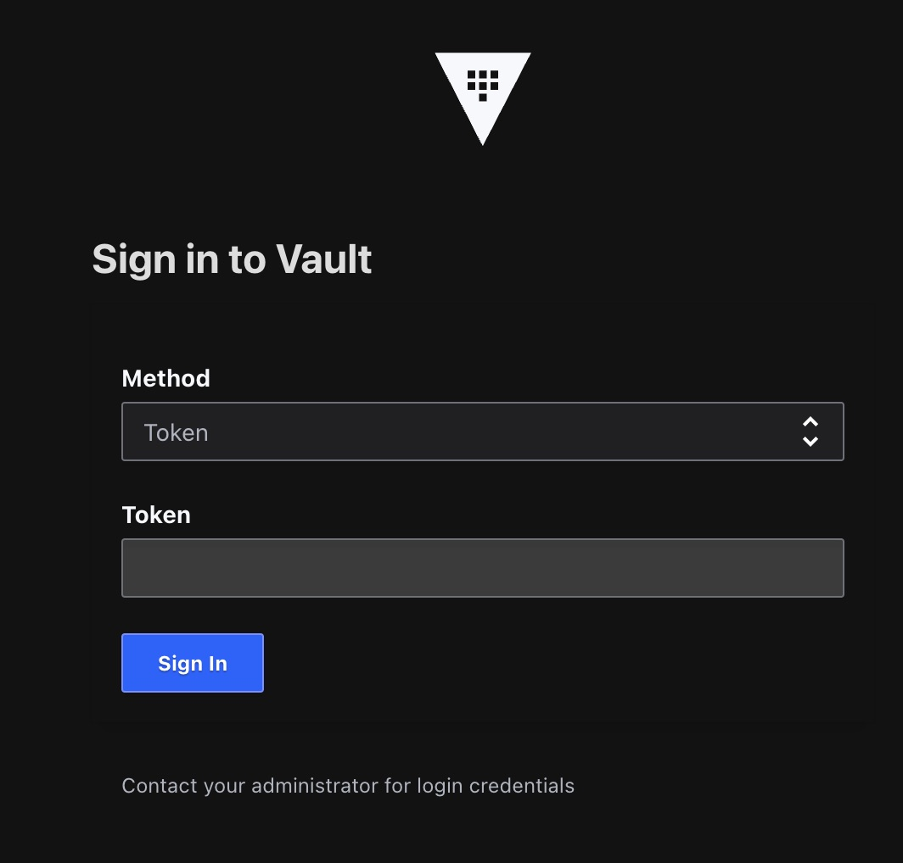

如果你希望追蹤最新的草稿，請見[鐵人賽2023](https://chechia.net/zh-hant/tag/%E9%90%B5%E4%BA%BA%E8%B3%BD2023/)

# Day 02 準備：執行一個本地開發用途的 Vault

整篇 Workshop 會使用的範例與原始碼，放在 [Github Repository: vault-playground](http://chechia.net/zh-hant/#projects)


### 準備工作

在開始進行 Vault 30 天 workshop 之前，有一些準備工作需要完成：

步驟1：下載 Vault Binary

首先，你需要下載HashiCorp Vault的最新版本。你可以在HashiCorp的官方網站上找到Vault的下載鏈接。請確保下載適用於你操作系統的版本。

https://developer.hashicorp.com/vault/downloads
- [MacOS amd64](https://releases.hashicorp.com/vault/1.14.3/vault_1.14.3_darwin_amd64.zip)
- [MacOS arm64](https://releases.hashicorp.com/vault/1.14.3/vault_1.14.3_darwin_arm64.zip)
- [Linux](https://releases.hashicorp.com/vault/1.14.3/vault_1.14.3_linux_amd64.zip)

步驟2：安裝Vault

下載完成後，根據你的操作系統進行安裝。對於大多數Linux和Unix系統，你c可以通過解壓縮壓縮文件來安裝Vault。將Vault Binary文件移至你的PATH中，以便在終端中輕鬆訪問

筆者使用的是 Mac M1，使用以下指令進行安裝

```bash
wget https://releases.hashicorp.com/vault/1.14.3/vault_1.14.3_darwin_arm64.zip
unzip vault_1.14.3_darwin_arm64.zip

sudo mv vault /usr/local/bin/vault

Vault v1.14.3 (56debfa71653e72433345f23cd26276bc90629ce), built 2023-09-11T21:23:55Z
```

你不需要使用最新版本的 Vault 也可以完成這次 workshop

### 啟動 Vault server

使用以下指令在本地啟動 Vault Server。請確保 Vault 伺服器已正確啟動，並且未出現錯誤消息。

```bash
vault server -dev
```
使用 -dev 選項可以啟動Vault的開發模式，該模式不需要身份驗證即可運行Vault。

### 確認Vault運行

打開你的瀏覽器，瀏覽到 http://127.0.0.1:8200



或者使用 curl 命令發送 GET 請求：

```bash
curl http://127.0.0.1:8200/v1/sys/health | jq

{
  "initialized": true,
  "sealed": false,
  "standby": false,
  "performance_standby": false,
  "replication_performance_mode": "disabled",
  "replication_dr_mode": "disabled",
  "server_time_utc": 1694693898,
  "version": "1.14.3",
  "cluster_name": "vault-cluster-3273d150",
  "cluster_id": "a32d555e-3346-0757-1d57-21e2f646aaf3"
}
```

如果Vault正常運行，你應該會收到一個包含Vault訊息的JSON response。

也可使用 Vault Binary 來存取 Vault API

export Vault Server 的 http endpoint (我們尚未啟動 tls listener，所以沒有 https endpoint)

```bash
export VAULT_ADDR='http://127.0.0.1:8200'
```

```bash
vault status

Key             Value
---             -----
Seal Type       shamir
Initialized     true
Sealed          false
Total Shares    1
Threshold       1
Version         1.14.3
Build Date      2023-09-11T21:23:55Z
Storage Type    inmem
Cluster Name    vault-cluster-3273d150
Cluster ID      a32d555e-3346-0757-1d57-21e2f646aaf3
HA Enabled      false
```

可以看到本地的 Vault server
- 已初始化
- 已解封
- 版本
- 未啟用 HA

也可以使用 Vault Binary 中的 operator 指令檢測

```bash
vault operator members

Host Name                     API Address              Cluster Address           Active Node    Version    Upgrade Version    Redundancy Zone    Last Echo
---------                     -----------              ---------------           -----------    -------    ---------------    ---------------    ---------
CheChias-MacBook-Pro.local    http://127.0.0.1:8200    https://127.0.0.1:8201    true           1.14.3     n/a                n/a                n/a
```

### 初始化Vault

在開發模式下運行的Vault可能不需要初始化，但如果你使用的是 production 模式，請參考Vault的官方文檔，進行初始化和設置。

Vault server 在 dev 模式下啟動後，會自動產生一隻單一個 unseal key，與一把 Root Token。

```bash
WARNING! dev mode is enabled! In this mode, Vault runs entirely in-memory
and starts unsealed with a single unseal key. The root token is already
authenticated to the CLI, so you can immediately begin using Vault.

You may need to set the following environment variables:

    $ export VAULT_ADDR='http://127.0.0.1:8200'

The unseal key and root token are displayed below in case you want to
seal/unseal the Vault or re-authenticate.

Unseal Key: JbKrVzhH4VO14nPBRvWE1qxJz9CVhnOFJT0pYLsx9LU=
Root Token: hvs.0pmmzGSZ8S7w8vP2E4sm7SqE

Development mode should NOT be used in production installations!
```

你可以使用 vault operator 指令，嘗試 seal Vault server

```bash
vault operator seal

Success! Vault is sealed.
```

再次檢查 status

```bash
vault status

Key                Value
---                -----
Seal Type          shamir
Initialized        true
Sealed             true
Total Shares       1
Threshold          1
Unseal Progress    0/1
Unseal Nonce       n/a
Version            1.14.3
Build Date         2023-09-11T21:23:55Z
Storage Type       inmem
HA Enabled         false
```

顯示為密鑰密封（Sealed）狀態

你可以使用 vault operator 解封 Vault

```bash
vault operator unseal JbKrVzhH4VO14nPBRvWE1qxJz9CVhnOFJT0pYLsx9LU=

Key             Value
---             -----
Seal Type       shamir
Initialized     true
Sealed          false
Total Shares    1
Threshold       1
Version         1.14.3
Build Date      2023-09-11T21:23:55Z
Storage Type    inmem
Cluster Name    vault-cluster-3273d150
Cluster ID      a32d555e-3346-0757-1d57-21e2f646aaf3
HA Enabled      false
```

顯示為解封狀態

### 密鑰安全

本 workshop 中使用的 vault server / seal key / root token 都是測試用途的暫時性存在，筆者寫完文章後，這些 server 與密鑰早已經清理完畢，所以沒有資安風險。

為了示範方便，workshop 會以明碼 plain text 形式表現

如果你是在公司的 production 環境使用，務必要確保密鑰的安全
- 不要在 local 電腦上存放 token 或 seal key
- 不要在沒有密碼學與資安檢測的平台上儲存 token 或 seal key
- 不要透過通訊軟體(ex. slack) 明碼傳送 token 或 seal key
...

你可能會問，本地不能存，遠端也不能存，也不能隨意傳送給同事，那應該如何協作與管理？

在後面的 workshop 內容會與大家一一示範解說

### Dev 模式

你可以關閉執行 vault server 的 terminal session 來關閉 vault server

```bash
vault server -dev

ctrl + c
```

https://developer.hashicorp.com/vault/docs/concepts/dev-server

"Dev" 伺服器模式

dev 模式的伺服器不需要進一步的設定，且你本地的 vault CLI 已經被認證。這使得使用 Vault 或啟動用於開發的 Vault instance 變得容易。Vault 的每一個功能在 "dev" 模式中都是可用的。-dev flag 只是將很多設置簡化為不安全的默認值。

警告：永遠、永遠、永遠不要在生產環境中運行 "dev" 模式伺服器。這是不安全的，且每次重新啟動都會丟失資料（因為它將資料存儲在記憶體中）。它僅供開發或實驗使用。

### dev 模式特性

dev 伺服器的屬性（有些可以使用命令行 flag 或指定配置文件來覆寫）：

初始化且未封印: 伺服器將自動初始化且未封印。你不需要使用 vault operator unseal。它立即可用。

記憶體存儲: 所有資料（加密後）都存儲在記憶體中。Vault 伺服器不需要任何檔案權限。

綁定到本地地址而不使用 TLS: 伺服器正在監聽 127.0.0.1:8200（默認的伺服器地址）而不使用 TLS。

自動認證: 伺服器存儲了你的 root access token，所以 vault CLI 存取已經準備好。如果你透過 API 存取 Vault，你需要使用打印出的 token 進行認證。

單一解封鑰匙: 伺服器使用單一的 unseal key 進行初始化。Vault 已經是解封的，但如果你想嘗試 seal/unseal，那麼只需要輸出的單一鑰匙。

安裝 key value storage: 在 secret/ 處安裝了一個 v2 KV secret engine。請注意 v1 KV 有所不同。如果你想使用 v1，使用此旗標 -dev-kv-v1。

### 第一次存取 vault 資料

建立通用 Key-Value 存儲： 使用以下命令在 Vault 中創建通用的 Key-Value 存儲。在這個例子中，我們將使用 secrets 作為存儲的路徑，你可以根據你的需求自行命名存儲路徑：

```bash
vault kv put secret/mysecrets username=admin password=secretpassword
```

這個命令將在 Vault 中創建一個 Key-Value 存儲，其中包含一對 Key value pair，分別是 username 和 password。

檢索存儲的值： 你可以使用以下命令檢索存儲中的值：

```bash
vault kv get secret/mysecrets
```

這個命令將返回存儲中的所有 Key Value pair。

更新存儲的值： 如果你需要更新存儲中的值，可以使用以下命令：

```bash
vault kv put secret/mysecrets password=newsecretpassword
```

這個命令將更新存儲中的 password 鍵的值。

刪除存儲的值： 若要刪除存儲中的值，可以使用以下命令：

```bash
vault kv delete secret/mysecrets
```

這個命令將刪除整個存儲路徑及其內容

### 關於 kv-v2

dev 模式下，Vault server 自動在 secret/ 處安裝了一個 v2 KV secret engine

Vault中的不同秘密引擎（Secret Engine）提供了不同的功能和特性。本次 workshop 會以最新，功能也最多元的 kv-v2 Secret Engine 為主。

以下是三種常見的秘密引擎（generic、kv v1 和 kv v2）之間的主要區別：

### Generic Secrets Engine（通用秘密引擎）

特性： 通用秘密引擎是你的最簡單的引擎之一，它允許你存儲和檢索通用的 Key Value Secret，這些 Secret 不需要特定的結構或格式。

用法： 通用秘密引擎適用於簡單的秘密存儲需求，其中 Secret 可以是任何形式的數據。你可以使用通用秘密引擎來存儲API金鑰、密碼、配置信息等。

### Key-Value (KV) Version 1 Secrets Engine（KV v1 秘密引擎）

特性： KV v1秘密引擎引入了一個有層次結構的鍵值存儲，允許你組織和版本控制儲存的 Secret。它具有 Secret 版本控制功能，可以保存多個版本的 Secret。

用法： KV v1引擎適用於需要有組織結構並希望保留秘密版本的情況。它可以用於存儲配置信息、TLS證書、API金鑰等。

### Key-Value (KV) Version 2 Secrets Engine（KV v2 秘密引擎）

特性： KV v2秘密引擎是KV v1的進化版本，它引入了更強大的特性，如可配置的 Secret Data type（如字符串、list 和 dict），並可設置的多版本的 Secret 存儲。

用法： KV v2引擎適用於更複雜的秘密管理需求，其中秘密可能具有不同的數據類型，並且需要更靈活的版本管理。它也用於配置信息、TLS證書、API金鑰等。

總結來說，通用秘密引擎適用於簡單的秘密存儲，而KV v1和KV v2秘密引擎適用於更複雜的秘密管理需求，具有更多的組織和版本控制功能。在選擇引擎時，請考慮你的具體需求和Vault的配置。通常，KV v2引擎是較新和更靈活的選擇，但根據你的情況，也可以考慮使用其他引擎。

### dev 使用情境

dev 伺服器應該用於實驗 Vault 的功能，例如不同的認證方法、Secret engine、audit device 等。

除了實驗，dev 伺服器對於開發環境的自動化非常容易。

### 小結

通過執行這些步驟，你可以確保本地安裝的 Vault Binary 正常運行。

請注意，Vault的實際配置和使用將根據你的需求和環境而有所不同，這些步驟主要用於確保Vault的基本功能正常運行。在 production 環境中，你需要更多的配置和安全性措施。
