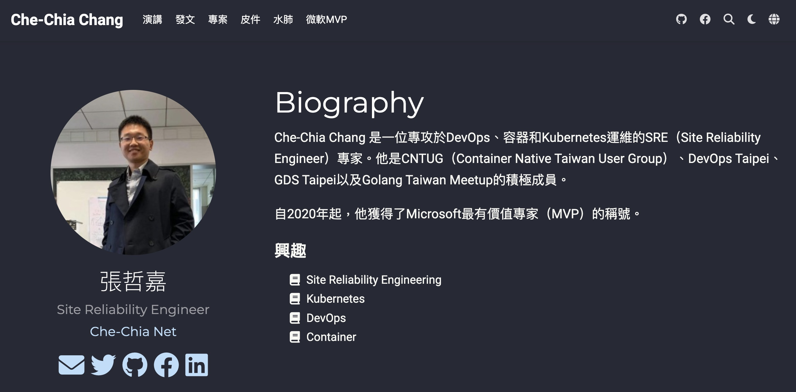
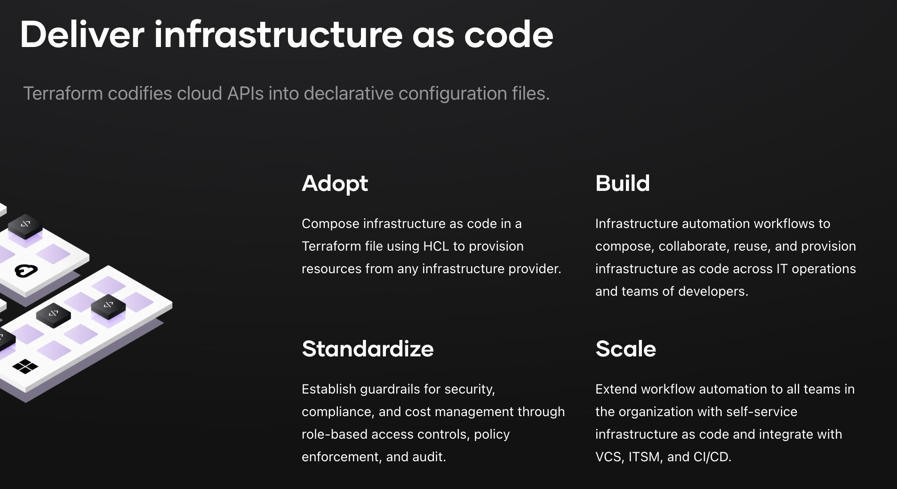
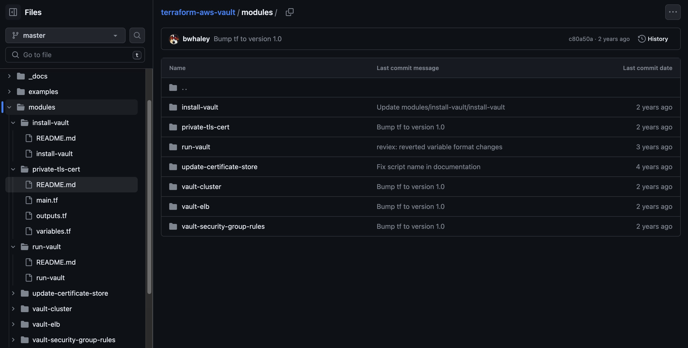
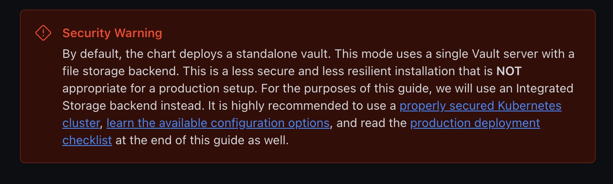



### 去找吧！我把所有財寶都放在那裡！

- 投影片，speaker notes
- example github repository
- 30 days terraform workshop
- 其他文章 DevOps / Kubernetes / Vault

{}
Q1: 有過使用 hashicorp vault 的人請舉手

沒使用過的人不是這個 session 的目標聽眾，可以 QR code 拍下來去聽別場。例如對面同題材的session
QR code 有投影片，範例 github repo，投影片裡還有講稿，所以我今天在這裡的用處就是念稿，真的可以 qrcode 拍了回家看

Q2: 有使用過 infrastructure as code / terraform 的人請舉手

有使用 vault 但是沒有使用 IaC 的朋友，才是這場 session 的主要受眾

Q3: 有使用 iac deploy vault stack，或是有使用 iac / vcs 管理 vault 內的 policy 的人請舉手

這些人可以出去吃零食，今天講的內容你們都會了，我沒什麼東西可以跟你們分享

{}

---



## HashiCorp Vault
## 自建金鑰管理最佳實踐

[Che Chia Chang](https://chechia.net/) | [Vault 鐵人賽 workshop](https://chechia.net/zh-hant/tag/%E9%90%B5%E4%BA%BA%E8%B3%BD2023/)

{}
s
標題有稍微修改
{}

---



[About Me](https://chechia.net/zh-hant/)

---

## Outline: prod-ready

- terraform deployment IaC
  - on aws / azure / gcp / k8s
  - get-started
- terraform configuration IaC
  - secret backends / auth method / role / policy /audit
  - gitflow / tested / automation

{}
manage vault infra & vault configuration from a aspect of devops
{}

---

## Vault 基礎的學習資源

- Vault + Kubernetes 請出門左轉DE會議室(Now)
- [2023-05-10 雲端地端通吃的私鑰管理平台](https://docs.google.com/presentation/d/1iex9lm89OCIR8IAoD1RPe4vcW--bcKBmMHoixDybqP8/edit?usp=sharing)
- [Vault 鐵人賽 30- day workshop](https://chechia.net/zh-hant/tag/%E9%90%B5%E4%BA%BA%E8%B3%BD2023/)
- [範例 Github](https://github.com/chechiachang/vault-playground)

---

## [production deploy checklist](https://developer.hashicorp.com/vault/tutorials/kubernetes/kubernetes-raft-deployment-guide#production-deployment-checklist)

- End-to-End TLS
- Single Tenancy
- Enable Auditing
- Immutable Upgrades
- Upgrade Frequently
- Restrict Storage Access

{}
{}

---

## Infrastructure as Code

- Deploy
  - (多環境)測試
- HA
  - storage backend
  - load balancer
- 維護：改 config，升級更新，監控，scheduled failover

{}
要如何達成上面這些事情？
- 需要 get started
- 大量的測試
{}

---



[https://www.terraform.io/](https://www.terraform.io/)

{}
{}

---

## Deploy on public cloud

- https://github.com/hashicorp/terraform-aws-vault
  - https://github.com/hashicorp/terraform-aws-vault-starter
- https://github.com/hashicorp/terraform-azurerm-vault
- https://github.com/terraform-google-modules/terraform-google-vault

{}
在公有雲 deploy Vault，雲服務商有提供既有的terraform module
不一定要照單全收，可以試著架起測試環境，然後調整terraform module，成為適合自己產品的架構
調整架構需要考量的點，底下分析
{}

---

## Deploy [terraform-aws-vault](https://github.com/hashicorp/terraform-aws-vault)


{}
hashicorp 官方提供的 terraform-aws-vault 是一個不錯的開始
{}

---

## [terraform-aws-vault](https://github.com/hashicorp/terraform-aws-vault)

- ELB -> AWS Autoscaling Group -> EC2
- Backend: consul cluster
- Vault AMI
- security group 
- [tested](https://github.com/hashicorp/terraform-aws-vault/blob/master/test/README.md) by hashicorp with [terratest](https://github.com/gruntwork-io/terratest)

{}
goto https://github.com/hashicorp/terraform-aws-vault
{}

---

## [terraform-aws-vault](https://github.com/hashicorp/terraform-aws-vault)



{}
如何使用
- 可以參考 main.tf 範例
- 可以檢視 ./modules 內說明逐步操作
{}

---

## [terraform-aws-vault-starter](https://github.com/hashicorp/terraform-aws-vault-starter)

- ELB -> AWS Autoscaling Group -> EC2
- security group 
- [Integrated storage (raft)](https://developer.hashicorp.com/vault/docs/concepts/integrated-storage)

{}
goto https://github.com/hashicorp/terraform-aws-vault-starter
{}

---

## Integrated storage

- goto [integrated-storage](https://developer.hashicorp.com/vault/docs/internals/integrated-storage)
- Raft Consensus protocol
  - 出incident要有辦法解
  - stateful server
  - 備份，管理(資料遷移) util 工具未必夠成熟
- 選一個會維護的[storage](https://developer.hashicorp.com/vault/docs/configuration/storage)
  - [DynamoDB](https://developer.hashicorp.com/vault/docs/configuration/storage/dynamodb)
  - [MySQL](https://developer.hashicorp.com/vault/docs/configuration/storage/mysql) / [PostgreSQL](https://developer.hashicorp.com/vault/docs/configuration/storage/postgresql)

{}
注意storage是否能夠為維護，重啟，備份
{}

---

## On Kubernetes

argocd + vault helm chart

server 與 injector 建議分開兩個 argocd applicatoin / helm release獨立deploy
- [server](https://github.com/hashicorp/vault-helm/blob/main/values.yaml#L357)
  - 選一個會維護的[storage backend](https://developer.hashicorp.com/vault/docs/configuration/storage)
- [injector](https://github.com/hashicorp/vault-helm/blob/main/values.yaml#L46)

{}
goto https://github.com/hashicorp/vault-helm/blob/main/values.yaml#L357

注意server 是否 ha
{}

---

## [Deploy On Kubernetes](https://developer.hashicorp.com/vault/tutorials/kubernetes/kubernetes-raft-deployment-guide)



- [secure your k8s](https://kubernetes.io/docs/tasks/administer-cluster/securing-a-cluster/)

{}
goto https://kubernetes.io/docs/tasks/administer-cluster/securing-a-cluster/

FAQ: on VM or on K8s?
問題不是 vault 在 VM 上安全，還是在 k8s 上安全
而是團隊能不能 secure 底下的 infra，如果熟 VM 就會覺得 VM 好做
secure k8s 是 VM + k8s 都要
{}

---

## 回到 Outline: prod-ready

- terraform configuration IaC
  - auth method / config / role
  - secret mounts
  - policy
    - team / people
    - application / service account
  - audit log

---

## Vault Configuration IaC 

- VCS / PR reviewed
- well-formed / linted / no-typo
- multiple env: dev, stag, prod
- programable / reusable: 標準化，可重複使用的 code
- tested
  - 可以為 terraform code 寫測試
  - 可以寫整合測試腳本測試 vault dev server
- automation
- auditable

{}
version control 有多重要？
- 有 / 沒有 review 的 code 品質，天差地遠
- 分享團隊知識，分享變更資訊
- 避免最雷的同事出包，全 team 的效能瓶頸
- change management 對於 vault 內的的更改要最嚴格控制
  - 沒有『誒是誰改了這個我怎麼不知道』這回事

Linter / formated 是工作效率的根本

多環境測試
- 有安全的測試環境，才能促進團隊創新
- 有 / 沒有 經過完整環境測試的 release 品質，天差地遠

Programable / Reusable
- variable / for loop
- reusable module / don't repeat your self

tested policy code
- policy as code
- terratest

automation
- gitflow
- secured admin access only to workflow. developer don't have admin access.

auditable
- audit in code / review
- live server generate audit log
- 外部稽核
{}

---

## [hashicorp official tutorial](https://developer.hashicorp.com/vault/tutorials/policies/policies#write-a-policy)

```
tee admin-policy.hcl <<EOF
# Read system health check
path "sys/health"
{
  capabilities = ["read", "sudo"]
}

# List existing policies
path "sys/policies/acl"
{
  capabilities = ["list"]
}
EOF
```

{}
configure vault policy with CLI
{}

---

```
vault policy write admin admin-policy.hcl

vault policy list

vault policy read admin
```

{}
CLI 管理很不方便
沒有 aggregated list view
查錯時需要耗費大量 api call 列出 policy 查表
透過 IaC sync policy code to server
{}

---

## Demo


---

# Questions?
