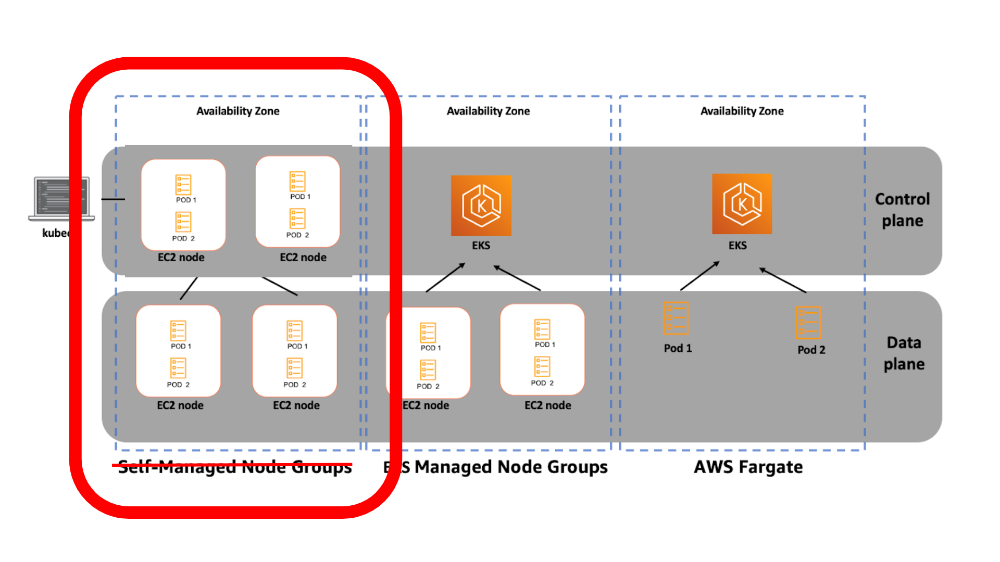

### Upgrade A VM Based Cluster

[Che Chia Chang](https://chechia.net/)

{}
{}

---

### 關於我

- Che Chia Chang
- SRE @ [Maicoin](https://www.cake.me/companies/maicoin/jobs)
- [Microsoft MVP](https://mvp.microsoft.com/zh-TW/MVP/profile/e407d0b9-5c01-eb11-a815-000d3a8ccaf5)
- 投影片與講稿都在 [chechia.net](https://chechia.net/) 
- [Etcd Workshop](https://chechia.net/zh-hant/talk/kubernetes-summit-get-started-with-etcd-kubernetes/)
- 鐵人賽 (Terraform / Vault 手把手入門)

---

### We're hiring!

https://www.cake.me/companies/maicoin/jobs


---

### 故事

- 為何要 AWS 自架 K8s
- 事前閱讀文件，規劃
- Upgrade Etcd
- Upgrade kube-apiserver / kube-controller-manager / kube-scheduler
- Upgrade Node
- Q&A

{}

{}

---

### 什麼是 VM-based Cluster

- Managed Kubernetes Service (GKE, EKS, AKS)
  - 公有雲託管 control plane，透過雲提供的介面控制
- self-hosted Kubernetes
  - cloud formation template ec2 node

---

### 什麼是 VM-based Cluster

公有雲只提供 VM，自己用其它工具搭 K8s Components
- kubeadm, kops, kubespray / docker, containerd, cri-o / container or systemd / ...
- 自己管理 control plane，包含 etcd, apiserver, controller-manager, scheduler
- 依需求選用公有雲提供的架構，ex VPC, ELB, EBS, S3, RDS, IAM, Route53, CloudWatch, CloudTrail, ...

---

K8s components


---

Self-hosted K8s


---

Self-hosted control plane



---

### 所以為何要在AWS上自架 K8s？

---

### 因為 2016 年的時候沒有 eks

---

### 因為 2016 年的時候沒有 eks

- 2014/10/15 kubernetes v0.4 [github](https://github.com/kubernetes/kubernetes/releases/tag/v0.4)
- 2014/11/04 [GKE release for 0.4.2](https://cloud.google.com/kubernetes-engine/docs/release-notes-archive#november_4_2014)
- 當時有很多解決方案再提供 self-hosted k8s，基於這些方案，我們自己架了一個
  - [github.com/getamis/vishwakarma](https://github.com/getamis/vishwakarma)
- 2017/10/24 [AKS generally available](https://azure.microsoft.com/en-us/blog/introducing-azure-container-service-aks-managed-kubernetes-and-azure-container-registry-geo-replication/)
- 2018/06/05 [EKS generally available](https://aws.amazon.com/blogs/aws/amazon-eks-now-generally-available/)

{}
{}

---

### Self-hosted control plane

self-hosted control plane 其實不難，那時有很多成熟的解決方案
- [k8s summit Etcd Workshop](https://chechia.net/zh-hant/talk/kubernetes-summit-get-started-with-etcd-kubernetes/)
- 降低服務商依賴
- 可以跨雲，跨地端，混合雲
- 自訂化，換 VM disk image，CNI，CSI，Ingress Controller
- 成本控制

{}
Self host 有一些好處
壞處就是要自己做的東西很多
隨著 cloud managed k8s 越做越好，自己架的理由越來越少
這也是當初百家爭鳴的自架解決方案，現在只剩下幾個
{}

---

### 結束背景，開始升級

---

### 起飛前規劃

需要事前研究跟規劃
- 確認目前版本與目標版本

---

### 需要升級的 K8s Components


---

### etcd

一個健康的 etcd cluster 可以幾乎 zero downtime rolling upgrade

如何確認 etcd 升版後是好的

---

### apiserver
### scheduler and controller manager

### application controllers

### 測試

smoke testing
- 直接驗證可行性
- 針對有使用的功能或是重要功能做測試
- 快速執行，早期發現問題
  - 問題不是有問題，而是有問題太晚發現

### 例如

ingress controller
- 測試腳本中測試 create / update / delete ingress

### 完整的多環境測試
### 好的監測

---

### Infra

Vishwakarma

https://github.com/getamis/vishwakarma/tree/master/examples/kubernetes-cluster-cilium-vxlan

---

### 監測

```
while true; do
    kubectl get pods -n kube-system; 
    sleep 2;
done
```

---

### 監測

- etcd dashboard
- k8s api dashboard

---

### Upgrade

- 選擇你的版號

---

### 參考資料

- https://kubernetes.io/docs/tasks/administer-cluster/cluster-upgrade/
- [Overview: Official doc](https://kubernetes.io/docs/tasks/administer-cluster/cluster-upgrade/)
