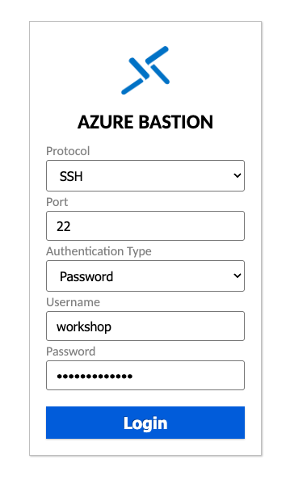
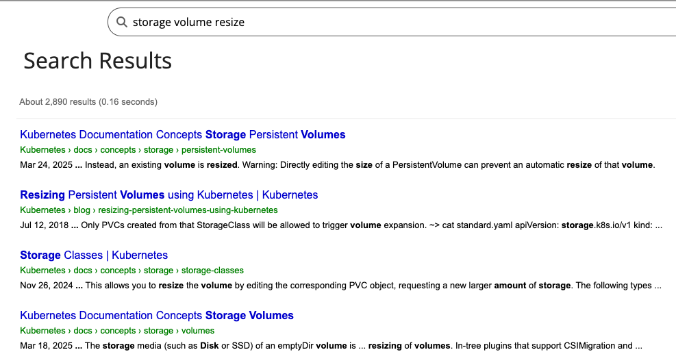
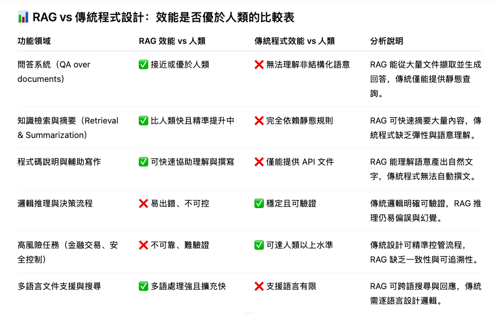

### RAG workshop 行前通知：基本需求

1. 當天帶自己的電腦。當天建議自備手機網路
  1. 選項1: 用電腦在 docker 運行開發環境
  1. 選項2: 用電腦遠端連線講師提供的 VM，在遠端VM 中運行 docker 開發環境
1. 會使用 docker
1. 會使用 python 與 jupyter notebook

---

##### 選項1: 使用自己的電腦 :computer:

- 在 workshop 開始前，在自己的電腦上
   1. 安裝 [docker](https://docs.docker.com/get-started/get-docker/)
   1. git clone 教材
   1. 啟動 docker 開發環境，下載 docker images
   1. 安裝所需的 Python 套件
   1. 開啟瀏覽器，連線到[http://localhost:8888](http://localhost:8888)

```bash
git clone https://github.com/chechiachang/rag-workshop.git

cd rag-workshop

docker compose up -d

docker exec -it notebook pip install pandas openai qdrant_client tqdm tenacity wget tenacity unstructured markdown ragas sacrebleu langchain_qdrant langchain-openai langchain_openai langchain_community tiktoken

登入token="workshop1234!"
```
---

##### 選項2: 使用遠端 VM

1. 有自己的電腦，當天建議自備手機網路，連線到遠端 VM
1. 提前註冊 tunnel 工具（沒有業配）
1. [Ngrok](https://dashboard.ngrok.com/login) 登入 Login -> 左手邊 Identity & Access -> Authtokens -> Add Tunnel authtoken -> 記在安全的地方
1.  也可以使用 [Pinggy](https://pinggy.io/)，但免費有限時

---

### 建議

1. 優先使用個人電腦。會盡量提供免費 VM 名額，但依參與人數不保證現場有
1. 在家先試跑一遍，把 docker image 跟 pip 套件都下載好，現場要載很久
1. 試完後記得關掉 ngrok，以免用完每月的免費額度
1. 事先看完內容覺得太簡單可以不用來，但歡迎會後找我聊天ＸＤ

---

### 投影片與教材與完整程式碼放在網站上

- [https://chechia.net](https://chechia.net)
- [https://chechia.net/zh-hant/slides/2025-06-05-devops-rag-internal-ai/](https://chechia.net/zh-hant/slides/2025-06-05-devops-rag-internal-ai/)
- :memo: [Github 投影片原始碼與講稿](https://github.com/chechiachang/chechiachang.github.io-src/blob/master/content/zh-hant/slides/2025-06-05-devops-rag-internal-ai/index.md)

---

### 以下是 RAG Workshop 當天內容

可以先看，也可以當天再看

---

### RAG Workshop 流程

1. **環境設定：確定參與者都有設定好開發環境**
1. 為什麼需要 RAG（Retrieval-Augmented Generation）
1. RAG: Embedding 與向量數據庫
1. RAG: Embedding Search
1. RAG: Evaluation
1. RAG 實際應用: 以 k8s official docs 為例

---

##### 選項1: 使用自己的電腦

1. 有在家先試跑一遍，應該可以在本地存取 Notebook [http://localhost:8888](http://localhost:8888)
1. 到 [workshop.chechia.net](https://workshop.chechia.net) 取得 OpenAI Key
1. 可以試著跑 notebook 2-5
1. 忘記怎麼啟動，可以回到投影片最開始

```
notebook token: workshop1234!
AZURE_OPENAI_API_KEY=""
AZURE_OPENAI_ENDPOINT=""
```

---

##### 選項2: 使用遠端 VM

1. 至[workshop.chechia.net](https://workshop.chechia.net) 領取一台 VM 並簽名
1. googel sheet 左邊 url，開啟 bastion 連線
1. Protocol: SSH，port 22，authentication type: password
1. 帳號密碼在[workshop.chechia.net](https://workshop.chechia.net)

---



---

##### 選項2: 使用 ngrok 連線到 jupyter notebook


1. 進入 VM 後，修改下面 ngrok authtoken。指令一行一行貼上（右鍵）到 bastion 中執行
1. 透過 https://4d11-52-230-24-207.ngrok-free.app/ 就可以使用 notebook (每個人不一樣)

```
cd rag-workshop
NGROK_AUTHTOKEN=<改成你的token>
sed -i "s/your-token/$NGROK_AUTHTOKEN/" docker-compose.yaml
docker compose up -d
docker logs ngrok

t=2025-06-02T06:17:41+0000 lvl=info msg="started tunnel" obj=tunnels name=command_line addr=http://notebook:8888 url=https://4d11-52-230-24-207.ngrok-free.app
```

---

### 以上是 Workshop 環境設定

1. 後面上課都透過這個網址操作
1. 還沒有看到 jupyter notebook 的人，請舉手

---

### RAG Workshop 流程

1. 環境設定：確定參與者都有設定好開發環境
1. **為什麼需要 RAG（Retrieval-Augmented Generation）**
1. RAG: Embedding 與向量數據庫
1. RAG: Embedding Search
1. RAG: Evaluation
1. RAG 實際應用: 以 k8s official docs 為例

---

### 知識獲取效率在 DevOps 的難題

在快速變動、資訊分散的環境中，難以即時取得需要的知識。「有但找不到、看不懂、用不起來」

1. 知識分散在多個系統、格式與工具中
1. 知識多為「靜態文件」，難以互動問答，舉例，或是換句話說
1. 隱性知識未被系統化儲存(例如：口頭傳承、slack 討論、會議紀錄等)
1. 查詢流程與開發流程脫節

---

### 情境：新人工程師要如何到 k8s doc 查到想要的內容？

1. 有問題去 google / stack overflow
1. 需要搜尋引擎(k8s doc 有提供，但內部文件系統不一定有)
1. 需要關鍵字(新人怎麼知道要查 Dynamic Persistent Volume Resizing)
1. 協助理解（舉例，換句話說）
1. 跨語言門檻

{}
k8s doc 有提供關鍵字搜尋，這個搜尋功能是怎麼做的？
Programmable Search Engine（PSE）https://developers.google.com/custom-search/docs/tutorial/introduction
Fulltext Search Engine 例如 elasticsearch 使用 Lucene
{}

---



{}
{}


---

> DevOps AI Copilot 不應該像圖書館守門員等人來借書，
> 而應該像導航系統，在你開車時主動告訴你：前方有彎道。

RAG + Context-Aware Knowledge Copilot

{}
這邊扯的比較遠，但基本上我們期待的解決方案是這樣
{}

---

### 什麼是 RAG

##### RAG（Retrieval-Augmented Generation，檢索增強生成）是一種結合檢索系統與生成式模型（如 GPT）的自然語言處理架構，在生成答案時引用外部知識，使模型回答更準確且具事實根據。

1. **Retrieval（檢索）：** 從一個外部知識庫（如文件、向量資料庫等）中找到與問題相關的資訊。通常會用語意向量（embeddings）做相似度搜尋。
2. **Generation（生成）：** 把檢索到的內容與使用者問題一起丟給 LLM（如 GPT、Claude 等）去生成答案。生成的內容會更具事實根據，並能引用具體資料。

---

### RAG 讓 DevOps 更智慧、少繁瑣、即時反應

1. 提升知識獲取效率: 內部文檔知識AI助手
1. 知識留存與新人 Onboarding
1. 加速故障排查: 根據錯誤訊息自動從 Runbook 中檢索處理方式
1. 優化流程自動化與提升決策品質: 通訊軟體對話 bot，自動生成建議

---

### RAG vs 傳統程式設計（Traditional Programming）

- 對我們需要工具提升知識獲取效率，如何選擇 RAG 或傳統程式設計
- 在特定任務的效能是否優於人類
- 哪裡適合用 RAG，哪裡適合用傳統程式設計

{}
{}

---



{}
適合用 RAG 的情境：客服問答、技術搜尋、知識型 Chatbot、內部知識導航。
適合用傳統程式的情境：金流控制、流程引擎、帳務系統、安全控制。
{}

---

### 有了大語言模型（LLM）後，情境變成：

1. 去 google -> 先問 chatgpt，初步問答理解問題，找到關鍵字
1. 需要搜尋引擎 -> chatgpt 整合，直接上網搜尋
1. 需要關鍵字 -> chatgpt 幫你找到關鍵字
1. 協助理解 -> chatgpt 舉例，換句話說
1. 跨語言門檻 -> chatgpt 翻譯

{}
chatgpt 會用通順的語言回答問題（優於平均工程師）
{}

---

- chatgpt 會用通順的語言，快速（數秒內）上網搜尋，回答問題
- 過程中不厭其煩地問答，換句話說
- 回答的格式高度客製化

---

##### LLM 不具備專業知識。缺乏內容根據時，LLM 容易產生幻覺(hallucination)


{}
LLM（大型語言模型）本身並不具備事實知識，而是依賴訓練時的語料與提示輸入來生成回答。當缺乏明確上下文或內容根據時，LLM 容易出現「幻覺」現象，即生成看似合理但實際不正確的資訊。專業領域問題若未提供準確資料支撐，也容易導致錯誤回答。
{}

---

### RAG Workshop 流程

1. 環境設定：確定參與者都有設定好開發環境
1. 為什麼需要 RAG（Retrieval-Augmented Generation）
   1. RAG 在「文件檢索與提示」上優於人類
   1. LLM 補強工程師的語言能力
1. **RAG: Embedding 與向量數據庫**
1. RAG: Embedding Search
1. RAG: Evaluation
1. RAG 實際應用: 以 k8s official docs 為例

---

### RAG Jupyter Notebook

1. Embedding with OpenAI.ipynb
2. Embedding Search with Qdrant and OpenAI.ipynb
3. RAG with OpenAI.ipynb
4. RAG DIY.ipynb
5. Evaluation.ipynb
6. k8s RAG QA.ipynb
